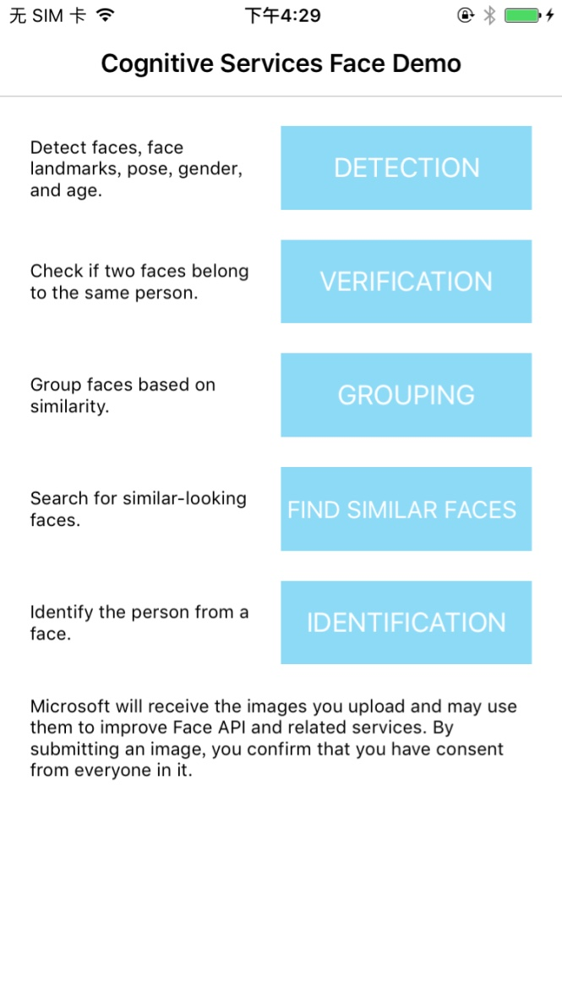
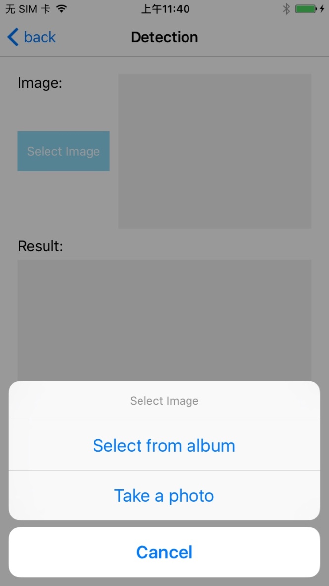
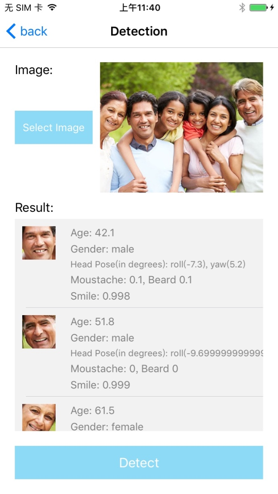
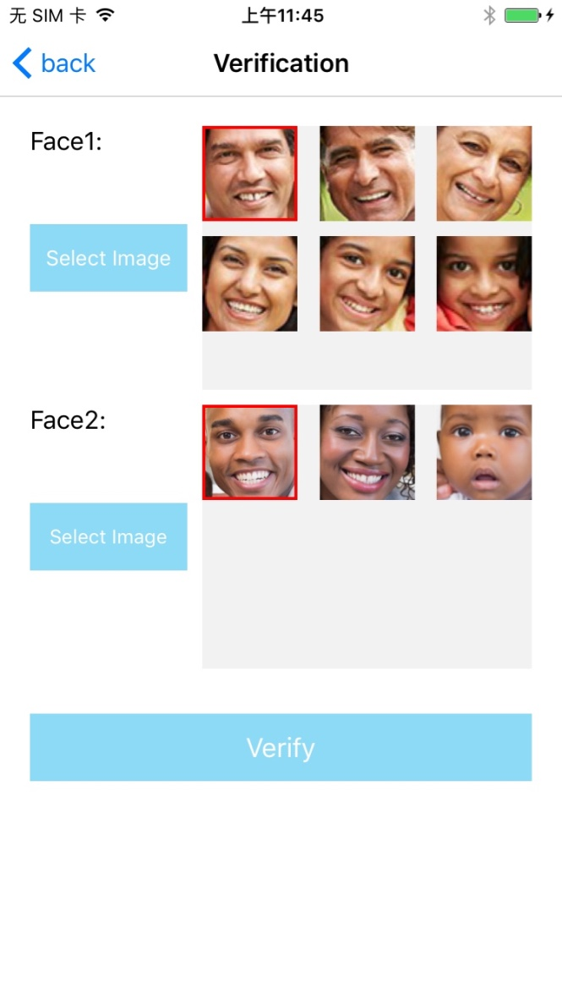
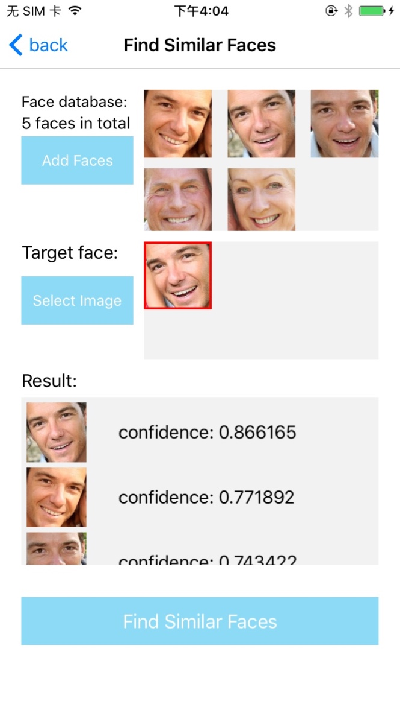
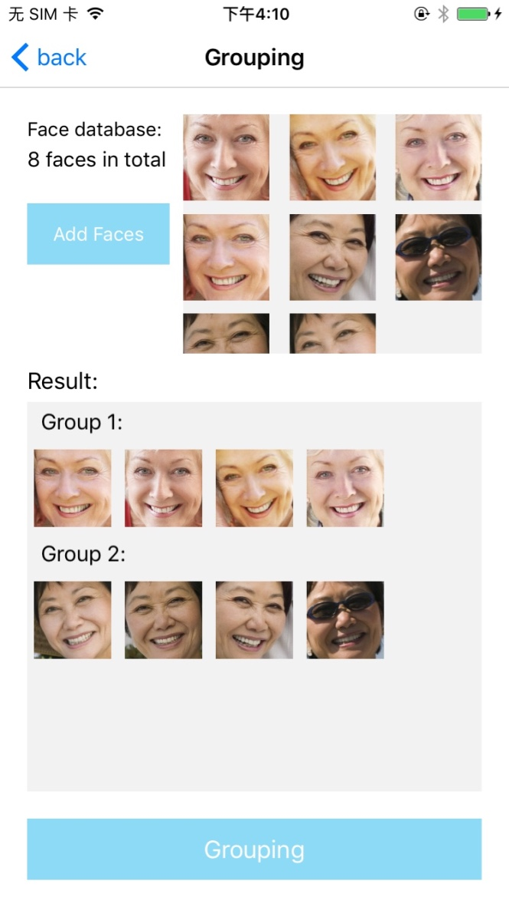
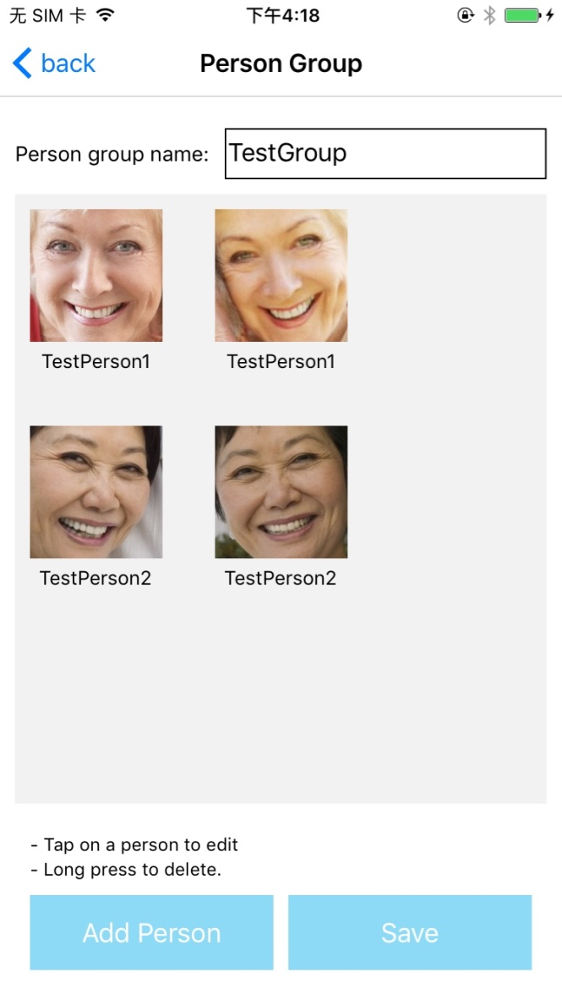

# Microsoft Face API: iOS Client Library & Sample
This repo contains the iOS client library & sample for the Microsoft Face API, an offering within [Microsoft Cognitive Services](https://www.microsoft.com/cognitive-services), formerly known as Project Oxford.
* [Learn about the Face API](https://www.microsoft.com/cognitive-services/en-us/face-api)
* [Read the documentation](https://www.microsoft.com/cognitive-services/en-us/face-api/documentation/overview)
* [Find more SDKs & Samples](https://www.microsoft.com/cognitive-services/en-us/SDK-Sample?api=face)

## The Client Library
The easiest way to consume the iOS client library is via CocoaPods. To install via Cocoapods
 1. [Install Cocoapods](http://guides.cocoapods.org/using/getting-started.html) - Follow the getting started guide to install Cocoapods.
 2. Add the following to your Podfile : `pod 'ProjectOxfordFace'`
 3. Run the command `pod install` to install the latest ProjectOxfordFace pod.
 4. Add `#import <ProjectOxfordFace/MPOFaceSDK.h>` to all files that need to reference the SDK.

## The Sample
The sample app demonstrates the use of the Microsoft Face API iOS client library. The sample shows scenarios such as face detection, face verification, and face grouping.

### Requirements
iOS must be version 8.1 or higher.

### Building and running the sample
The sample app should already have the necessary Pods shipped with it. Open the `ProjectOxfordFace.xcworkspace` in Xcode and build.

 1. First, you must obtain a Face API subscription key by [following the instructions on our website](<https://www.microsoft.com/cognitive-services/en-us/sign-up>).
 2. Once in Xcode, under the example subdirectory, navigate to the file `MPOAppDelegate.h` and insert your subscription key for the Face API
 3. To run the sample app, ensure that the target on top left side of Xcode is selected as `ProjectOxfordFace-Example` and select the play button or select Product > Run on the menu bar
 4. Once the app is launched, click on the buttons to try out the different scenarios.

Microsoft will receive the images you upload and may use them to improve Face API and related services. By submitting an image, you confirm you have consent from everyone in it.

### Having issues?
 1. Make sure you have selected `ProjectOxfordFace-Example` as the target.
 2. Make sure you have included the subscription key in `MPOTestConstants.h`.
 3. Make sure you have opened the `.xcworkspace` file and not the `.xcodeproj` file in Xcode.
 4. Make sure you have used the correct `Deployment Team` profile.
 5. Make sure you are running iOS 8.1 or higher

### Running and exploring the unit tests
Unit tests that demonstrate various Microsoft Cognitive Services scenarios such as detection, identification, grouping, similarity, verification, and face lists are located at `Example/Tests`. 

To run the unit tests, first insert your subscription key in `MPOTestConstants.h` and then select the test navigator pane in Xcode to display all of the tests which can be run.

## Contributing
We welcome contributions. Feel free to file issues and pull requests on the repo and we'll address them as we can. Learn more about how you can help on our [Contribution Rules & Guidelines](</CONTRIBUTING.md>). 

You can reach out to us anytime with questions and suggestions using our communities below:
 - **Support questions:** [StackOverflow](<https://stackoverflow.com/questions/tagged/microsoft-cognitive>)
 - **Feedback & feature requests:** [Cognitive Services UserVoice Forum](<https://cognitive.uservoice.com>)

This project has adopted the [Microsoft Open Source Code of Conduct](https://opensource.microsoft.com/codeofconduct/). For more information see the [Code of Conduct FAQ](https://opensource.microsoft.com/codeofconduct/faq/) or contact [opencode@microsoft.com](mailto:opencode@microsoft.com) with any additional questions or comments.

## Updates
* 8/2016: Library and sample updated for [July 2016 Face API changes](https://www.microsoft.com/cognitive-services/en-us/face-api/documentation/overview#changes)

## License
All Microsoft Cognitive Services SDKs and samples are licensed with the MIT License. For more details, see
[LICENSE](</LICENSE.md>).

Sample images are licensed separately, please refer to [LICENSE-IMAGE](</LICENSE-IMAGE.md>).

## Developer Code of Conduct
Developers using Cognitive Services, including this client library & sample, are expected to follow the “Developer Code of Conduct for Microsoft Cognitive Services”, found at [http://go.microsoft.com/fwlink/?LinkId=698895](http://go.microsoft.com/fwlink/?LinkId=698895).
